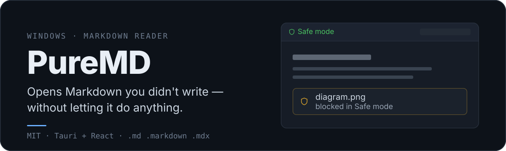
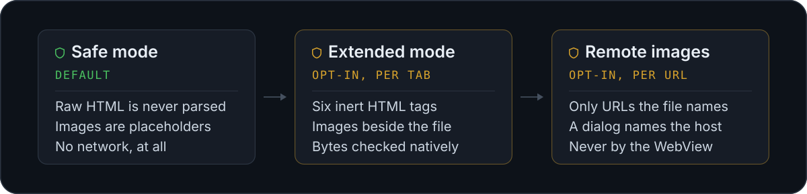

<p align="center">
  
</p>

PureMD is a Markdown reader and editor for Windows. It treats every file you open as
something you did not write: nothing is executed, nothing is fetched, and nothing is
rendered beyond plain text and Markdown until you say otherwise.


## How much a document may do

<p align="center">
  
</p>

Every widening is a decision you make, on one document, and it is dropped when the tab
closes, when you switch the mode off, and when the application exits. Nothing about it
survives a restart.

The WebView never reaches the network or the filesystem on its own. Images are read,
decoded and size-checked on the native side, then handed over as bytes — including
`data:` images, whose URI never becomes an image source. Remote images are fetched with
WinHTTP carrying no cookies, credentials, or User-Agent.

`THREAT_MODEL.md` documents the boundaries, the controls, and the known limits.

## Install

Two downloads on [Releases](https://github.com/quetzaone/puremd/releases), both x64:

- **`PureMD-Setup.exe`** — the installer. Run it, then open a `.md` file or start
  **PureMD** from the Start menu. It installs for the current user only, so there is
  no UAC prompt, and it registers `.md` and `.markdown` plus an uninstall entry.
- **`PureMD-<version>-portable-x64.zip`** — the application on its own. Unpack it and
  run `puremd.exe`. Nothing is installed and nothing is registered, so there are no
  file associations, no Start menu entry and nothing to uninstall. Not traceless,
  though: like any WebView2 application it keeps its session and settings under
  `%LOCALAPPDATA%`.

Requires Windows with the Microsoft Edge WebView2 Runtime — normally already present on
Windows 10 1803 and later. `.mdx` opens from inside the app either way.

## Reading and writing

Open a file and you are in Preview. `Ctrl+E` switches to the Markdown source and back.

- Tabs across the titlebar, up to 50, with the previous session restored on launch.
- An outline sidebar in Preview, a Markdown guide with copyable snippets in Code.
- A minimap that draws short documents as legible miniature text and long ones as a
  density map, marks every search hit, and scrubs the document when dragged.
- `Ctrl+F` highlights matches with the CSS Custom Highlight API, so the document and its
  source are never modified to show a result.
- `Ctrl+K` opens a command palette.
- Interface in English, Russian, and Spanish.

Before a document reaches the renderer, a native pass reads it and warns about unusual
constructs — raw HTML, unsafe URI schemes, remote image patterns, very large `data:`
URIs, extremely long lines, or excessive links and images. It is a heuristic that asks a
question, not a verdict: finding nothing does not make a file safe.

## What renders

| | Safe mode | Extended mode |
| --- | --- | --- |
| CommonMark + GFM tables, task lists, strikethrough, autolinks | yes | yes |
| Raw HTML | dropped | `details` `summary` `kbd` `mark` `sub` `sup` |
| Images beside the document, and `data:` images | placeholder | PNG, JPEG, GIF, WebP |
| One extra image folder, chosen in a native dialog | — | opt-in, revocable |
| Remote images | placeholder | opt-in per URL |
| SVG, scripts, iframes, embeds, absolute image paths | never | never |

Images are capped at 10 MiB, 40 megapixels, and 100 rendered per document, and the file
signature has to agree with the extension. A remote image that turns out to be an SVG is
refused like any other — which is why `shields.io` badges stay placeholders.

External `http` and `https` links open in your browser after a confirmation dialog that
shows the destination. Every other scheme is refused.

## Keyboard

| | |
| --- | --- |
| `Ctrl+O` `Ctrl+N` | Open file · New tab |
| `Ctrl+S` `Ctrl+Shift+S` | Save · Save As |
| `Ctrl+E` | Preview ⇄ Code |
| `Ctrl+F` | Find; `Enter` and `Shift+Enter` cycle matches, as do `F3` and `Ctrl+G` |
| `Ctrl+K` `Ctrl+M` | Command palette · Minimap |
| `Ctrl+W` | Close tab, asking first when there are unsaved changes |
| `Esc` | Close dialog, palette, menu, find bar — in that order |

## What it will not do

No telemetry, accounts, sync, update checks, or plugin system. No remote fonts:
JetBrains Mono is bundled under the SIL Open Font License. No Mermaid, iframes, or
embeds. Files are read and written only where you pointed a native dialog or Windows
open-with.

PureMD is not a sandbox against a hostile operating system, and it cannot protect you
from a vulnerability in Windows, WebView2, Tauri, or a dependency.

## Building

```sh
npm install
npm run tauri dev
```

```sh
npm.cmd run build
npm.cmd run tauri -- build
```

Use `npm.cmd run tauri -- build` for a release binary; a plain `cargo build --release`
skips Tauri's frontend bundling and can leave the executable pointing at the development
`localhost` URL. Outputs land in `src-tauri/target/release/`, with the installer under
`bundle/nsis/`.

`npm run check` asserts the one thing that would fail silently: that raw HTML is parsed
only in Extended mode, and only ahead of the sanitizer.

## Source map

| | |
| --- | --- |
| Shell and UI state | `src/App.tsx` |
| Preview renderer, images, link handling | `src/markdown/MarkdownPreview.tsx` |
| Sanitizer schemas and URL policy | `src/markdown/sanitize.ts`, `src/markdown/linkPolicy.ts` |
| Native commands, path authorization, image validation | `src-tauri/src/lib.rs` |
| Styling | `src/styles/app.css`, `src/styles/markdown.css` |
| Icon source and packer | `src-tauri/icons/app-icon.svg`, `tools/make-ico.mjs` |

## Contributing

Changes should preserve the local-first safety model. Read `CONTRIBUTING.md` before
touching rendering, filesystem access, links, native dialogs, or dependencies, and
`TESTING.md` for the Windows test pass.

## License

MIT. See `LICENSE`.
